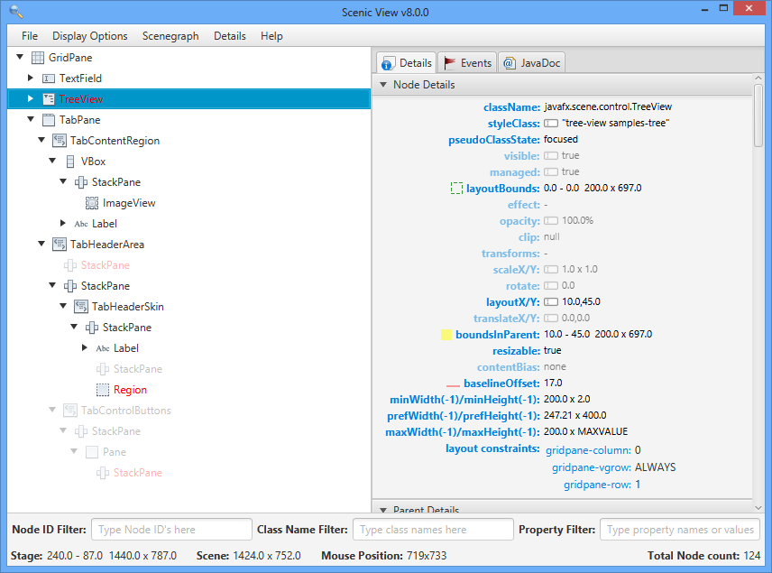
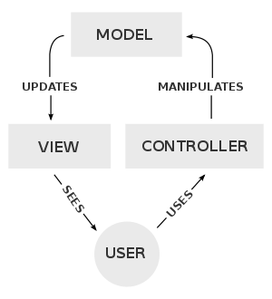

class: middle, center

# A short introduction to JavaFX

---
# About JavaFX

- First release in 2008
- Current version: JavaFX 9.0 
- Intended to replace Swing as standard library for Java GUIs
- Both Swing and JavaFX are still included in current Java 
- In future (Sep. 2018): JavaFX will not be part of the standard JDK with further development by OpenJFX 

---
# Where to find help? 

- [Official Documentation](https://docs.oracle.com/javase/8/javase-clienttechnologies.htm)
- [API Document](https://docs.oracle.com/javase/8/javafx/api/overview-summary.html) with informations and usage of all classes and interfaces
- Independant online documentation [Tutorial Points](https://www.tutorialspoint.com/javafx/index.htm)
- Youtube Courses [thenewboston](https://www.youtube.com/watch?v=FLkOX4Eez6o)
- Lecture advanced java for bioinformatics (Wintersemester, Prof. Huson)

---
# Running a JavaFX Application:


---
# The scene graph
[doc](https://docs.oracle.com/javafx/2/scenegraph/jfxpub-scenegraph.htm)

* Tree data structure
* Contains all graphical objects in the application
* Items are called Nodes


---
# Scenic View
[link](http://fxexperience.com/scenic-view/)

* This tool shows the scene graph of a running JavaFX Application
* Useful for debugging and development



---
# Nodes

- Shapes:
    - Geometric Objects

- Parents: Base class for nodes with children
    - **Group**: Collection of child nodes, not resizable. When larger then available space it will be clipped
    - **Panes**: Collection of child nodes, resizable. Size is set by its parents. When larger then available space: Rescaled
        - AnchorPane
        - FlowPane
        - Hbox
        - VBox
	These panes are called **Layout-Panes **

[doc](https://docs.oracle.com/javafx/2/layout/builtin_layouts.htm)
---

## Example: Creating a pane and adding children

```java
Pane canvas = new Pane();
     canvas.setStyle("-fx-background-color: black;");
     canvas.setPrefSize(200,200);

     Circle circle = new Circle(50,Color.BLUE);
     circle.relocate(20, 20);
     Rectangle rectangle = new Rectangle(100,100,Color.RED);
     rectangle.relocate(70,70);

     canvas.getChildren().addAll(circle,rectangle);

```


---

# Shapes

[doc](https://docs.oracle.com/javase/8/javafx/api/javafx/scene/shape/Shape.html)

* Arc
* Circle
* CubicCurve
* Ellipse
* Line
* Polygon
* Rectangle
* Text

Interesting Properties:
- stroke -> Defines colour of the border 
- fill -> Defines colour inside the shape


---
# Properties

[doc](https://docs.oracle.com/javafx/2/binding/jfxpub-binding.htm)

Limits of static, linear program flow
    - Methods need to be executed when objects are modified
    - Dynamic responses to user input (click button)
    - Update view when model changes

All this can be achieved with *Properties* and *Bindings*

---
# Properties

Instead of *"normal"* classes use properties
Example: DoubleProperty instead of Property

```java
package playground;

import javafx.beans.property.DoubleProperty;
import javafx.beans.property.SimpleDoubleProperty;

class PropertyTest {

    private DoubleProperty radius = new SimpleDoubleProperty();
    private DoubleProperty area = new SimpleDoubleProperty();

    public PropertyTest(DoubleProperty radius) {
        this.radius = radius;
        setRadius(20);

        // Add listener
        radius.addListener((observable, oldValue, newValue) -> {
            System.out.println(newValue);
        });

        // Add binding
        area.bind(radius.multiply(2 * Math.PI));

    }

    // Setter
    public final void setRadius(double x) {
        radius.setValue(x);
    }

}
```

This example uses **Lambda expressions**:
[blog post](http://code.makery.ch/blog/javafx-8-event-handling-examples/)

---
# Nodes have built-in Properties

Try to use properties for almost everything in JavaFx !

```java
// Add changelistener for model Nodes (Atoms)
proteinGraph.nodeList.addListener((ListChangeListener<ProteinNode>) c -> {
   while (c.next()){
	   if (c.wasAdded()){
		   for (ProteinNode proteinNode:c.getAddedSubList()){
			   //System.out.println("Detected Change: Added atom");
			   createAtomView(proteinNode);
			   //createBondConnectionView(proteinNode);
		   }
	   }
	   if (c.wasRemoved()){
		   for (ProteinNode proteinNode:c.getRemoved()){
			   atomViewGroup.getChildren().remove(findAtomViewFor(proteinNode));
		   }
	   }
   }
});

``` 

```
---
# Design patterns

Proposition for JavaFX: MVC **M**odel **V**iew **C**ontroller



There are many variations on this scheme. You can try to do something similar to  [this](https://stackoverflow.com/a/32343342)
---
# Model:

* contains data
* calculates stuff
* file I/O
* contains only getter and setter
* no reference to View or Controller
* works independent of GUI

---
# View:
* Contains all graphical elements (nodes)
* Only display, no calculating methods

---
# Controller:
* Connects View and Model
* Contains 

---
# FXML
Based on XML (similar to html)

Java only:
```java
BorderPane border = new BorderPane();
Label toppanetext = new Label("Page Title");
border.setTop(toppanetext);
Label centerpanetext = new Label ("Some data here");
border.setCenter(centerpanetext);

```

with FXML:
```java
<BorderPane>
    <top>
        <Label text="Page Title"/>
    </top>
    <center>
        <Label text="Some data here"/>
    </center>
</BorderPane>
```


---
# (Gluon) Scene Builder

- Can be integrated into IntelliJ

---


